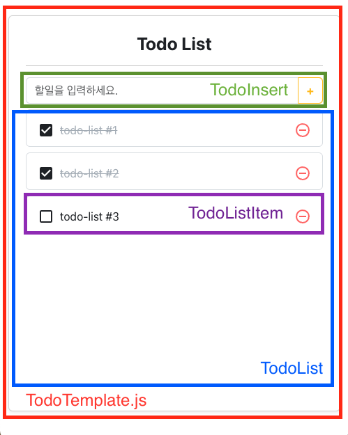
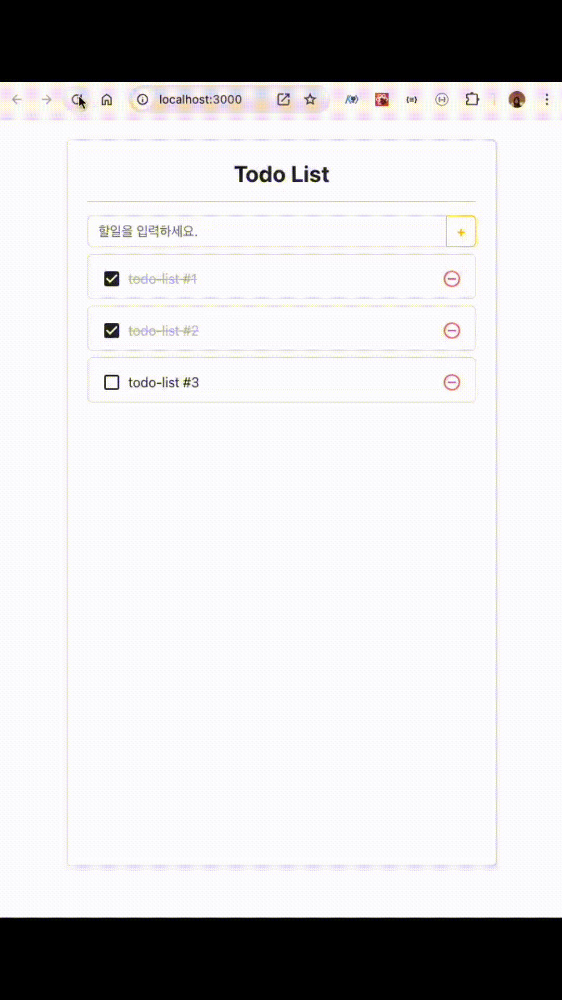

## TodoList(부트스트랩 사용)

> 항목 추가, 삭제


```javascript
<TodoTemplate>
    <ToDoInsert />
    <ToDoList> //할 일 목록(ul)
        <ToDoListItem /> //할 일 (li)
    </ToDoList>
	<ToDoEdit /> //수정하기 창
</TodoTemplate>
```
---



