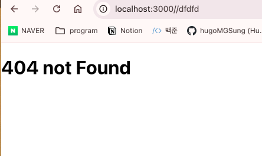
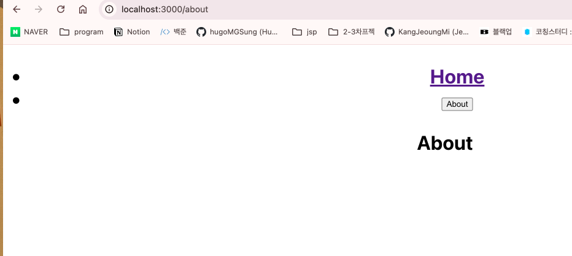
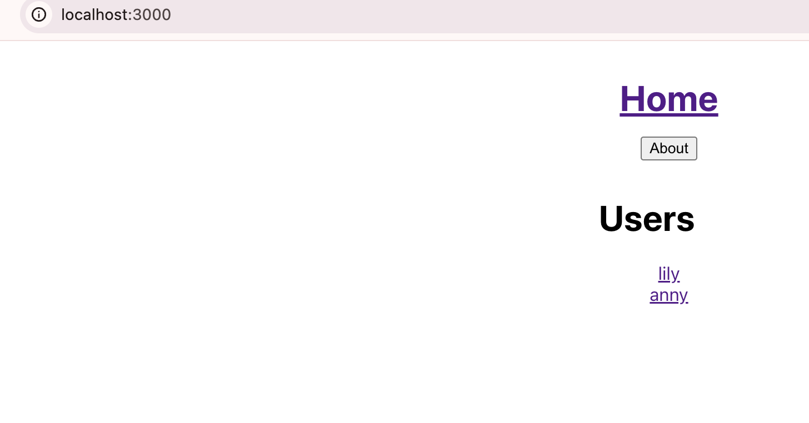
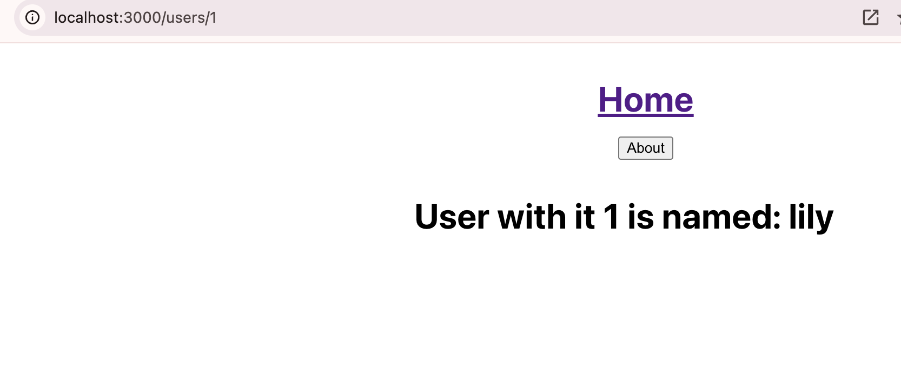
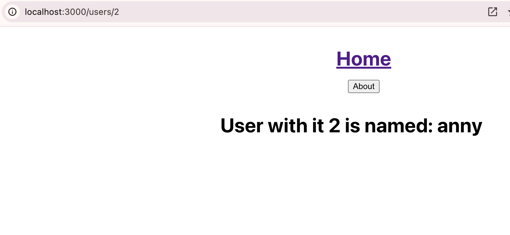

### ReactRouterDom 학습

## 목차
1. `ReactRouter`란
2. `BrouserRouter`, `createBrowserRouter`
3. `errorElement`, `useNavigate`, `useParams`
4. `Outlet`, `useOutletContext`
---
## 1. `ReactRouter`란
> - 사용자가 입력한 주소를 감지하는 역할을 하며, 여러 환경에서 동작할 수 있도록 여러 종류의 라우터 컴포넌트를 제공한다
> - `BrouserRouter`, `HashRouter`
---

## 2. `BrouserRouter`, `createBrowserRouter`

### **`BrouserRouter`**
> [Screens/About.tsx]
```javascript
function About(){
    return <h1>About</h1>
}
export default About;
```
> [Screens/Home.tsx]
```javascript
function Home(){
    return <h1>Home</h1>
}
export default Home;
```
> [components/Header.tsx]
```javascript
import { Link } from "react-router-dom";

function Header(){
    return (
        <h1>
            <ul>
                <li>
                <Link to={"/"}>Home</Link>
                </li>
                <li>
            <Link to={"/about"}>About</Link>
                </li>
            </ul>
        </h1>
    );
}
export default Header;
```
> [Screens/Router.tsx]
```javascript
import { BrowserRouter, Route, Routes } from "react-router-dom";
import Header from "../components/Header";
import About from "./About";
import Home from "./Home";
function Router(){
    return <BrowserRouter>
        <Header />
        <Routes>
            <Route path="/" element={<Home />}/>
            <Route path="/about" element={<About />}/>
        </Routes>
    </BrowserRouter>
}
export default Router;
```


### **`createBrowserRouter`**
> ✎ `React`에서 사용하는 `React Router` 라이브러리의 기능 중하나로, 브라우저 히스토리를 사용하는 라우터를 생성하는데 사용
> ✎ `React Router`는 **SPA(Single Page Application)**에서 클라이언트 사이드 라우팅을 쉽게 구현할 수 있도록 돕는 라이브러리이다.
> ✎ **React Router v6**부터 라우터 설정이 간편해 졌으며 객체의 배열을 받아 브라우저 기반의 라우터를 생성한다.

[Router.tsx]
```javascript
import { createBrowserRouter } from "react-router-dom";
import Root from "./Root";
import About from "./Screens/About";
import Home from "./Screens/Home";
const router = createBrowserRouter([
    {
        path: "/", // path : 부모, about/home : 자식
        element: <Root/>,
        children: [
            {
                path: "about",
                element: <About/>
            },
            {
                path: "",
                element: <Home/>
            }
        ]
    }
]);
export default router;
```

|설명|
|---|
`path: "/" `는 부모 경로이며 `element: <Root/>`는 이 경로의 투트 컴포넌트이다
`children: []` 에 자식 경로 배열을 `{}`형식으로 넣는다
```javascript
{
    path: "about", // /about 경로
    element: <About/> // 이 경로에 대한 컴포넌트 : ./Screens/About
}```

[Root.tsx]
```javascript
import { Outlet } from 'react-router-dom';
import './App.css';
import Header from './components/Header';
function App() {
  return (
    <div className="App">
      <Header/>
      <Outlet/>
    </div>
  );
}
export default App;
```
|설명|
|---|
`<Outlet/>` : 부모 라우트에서 정의된 자식 라우트를 렌더링하는 데 사용됨. 이 컴포넌트를 통해 부모 컴포넌트는 자식 라우트를 위한 위치 지정가능
**동작방식**  : 부모 컴포넌트(예: Root)에서 <Outlet />을 사용하면, 해당 부모 경로에 대한 자식 경로가 요청될 때, 자식 컴포넌트가 <Outlet />이 위치한 곳에 렌더링됨

[index.tsx]
```javascript
import React from 'react';
import ReactDOM from 'react-dom/client';
import { RouterProvider } from 'react-router-dom';
import './index.css';
import reportWebVitals from './reportWebVitals';
import router from './Router';

const root = ReactDOM.createRoot(
  document.getElementById('root') as HTMLElement
);
root.render(
  <React.StrictMode>
    <RouterProvider router={router}/>
  </React.StrictMode>
);
```
|설명|
|---|
`router={router}` : `router`라는 prop을 통해 설정된 라우터를 받아, 애플리케이션 전체에서 라우팅을 하능하게 함
---

## 3. `errorElement`, `useNavigate`, `useParams`
### `errorElement`
> ✎ 특정 경로에서 오류가 발생 했을 때 사용자에게 오류를 보여 주기 위함
[component/ErrorComponent.tsx]
```javascript
function ErrorComponent(){
    return <h1>This component crashed</h1>
}

export default ErrorComponent;
```

[Screens/NotFound]
```javascript
function NotFound(){
    return <h1>404 not Found</h1>
}

export default NotFound;
```
|설명|
|---|
에러 페이지를 보여줌

[Router.tsx]
```javascript
import { createBrowserRouter } from "react-router-dom";
import ErrorComponent from "./components/ErrorComponent";
import Root from "./Root";
import About from "./Screens/About";
import Home from "./Screens/Home";
import NotFound from "./Screens/NotFound";
import User from "./Screens/users/User";
const router = createBrowserRouter([
    {
        path: "/", // path : 부모, about/home : 자식
        element: <Root/>,
        children: [
            {
                path: "about",
                element: <About/>
            },
            {
                path: "",
                element: <Home/>,
                errorElement: <ErrorComponent />
            },
            
        ],
        errorElement: <NotFound/>,
    }
])
export default router;
```
|설명|
|---|
`errorElement: <NotFound/>` : 오류 발생 시 `NotFound`를 렌더링 한다



### `useNavigate`
> ✎ `HOOK`의 한종류로, 프로그램 방식으로 경로를 변경할 수 있게 해준다
> ✎ 예를들어 버튼을 클릭하거나 어떤 조건이 충족되었을 때 특정 페이지로 이동해야 하는 경우 사용한다
```javascript
import { Link, useNavigate } from "react-router-dom";

function Header(){
    const navigate = useNavigate(); // // useNavigate 훅을 사용하여 navigate 함수 생성
    const onAboutClick = () => {
        navigate("/about"); // "/about"로 경로 변경
    };
    return (
        <h1>
            <ul>
                <li>
                <Link to={"/"}>Home</Link>
                </li>
                <li>
            <button onClick={onAboutClick}>About</button>
                </li>
            </ul>
        </h1>
    );
}
export default Header;
```
|설명|
|---|
위와 같이 링크로 경로를 지정하는 것이 아닌 **버튼 클릭을 하였을 때** 다른 페이지로 이동하기 위하여 `useNavigate`를 사용할 수 있다

navigate 함수 사용법
- 경로 이동 : `navigate('/path');`
- 뒤로가기 : `navigate(-1);`
- 앞으로 가기 : `navigate(1);`
- 상태전달 : `navigate('/path', { state: { key: 'value' } });`
- 대체 경로 : `navigate('/path', { replace: true }); `



### `useParams`
> ✎ `HOOK`의 한종류로, 현재 URL의 동적 세그먼트(즉, 경로 매개변수)에 접근할 수 있게 해준다
> ✎ 이를 통해 URL에 포함된 변수 값을 쉽게 가져온다

[db.ts]
```javascript
export const users = [
    {
        id: 1,
        name: "lily"
    },
    {
        id: 2,
        name: "anny"
    },
]
```
|설명|
|---|
샘플 데이터베이스를 타입스크립트로 제작한다.

[Screen/users/User.tsx]
```javascript
import { useParams } from "react-router-dom";
import { users } from "../../db";

function User(){
    const {userId} = useParams();
    return (
        <h1>
            User with it {userId} is named: {users[Number(userId)-1].name}
        </h1>
    )
   
}
export default User;
```
|설명|
|---|
`db.ts`에 있는 데이터를 추출한다
`const {userId} = useParams();` userId는 URL의 :userId에서 추출된 값

[Router.tsx]
```javascript
import { createBrowserRouter } from "react-router-dom";
import ErrorComponent from "./components/ErrorComponent";
import Root from "./Root";
import About from "./Screens/About";
import Home from "./Screens/Home";
import NotFound from "./Screens/NotFound";
import User from "./Screens/users/User";
const router = createBrowserRouter([
    {
        path: "/", // path : 부모, about/home : 자식
        element: <Root/>,
        children: [
            {
                path: "about",
                element: <About/>
            },
            {
                path: "",
                element: <Home/>,
                errorElement: <ErrorComponent />
            },
            {
                path: "users/:userId",
                element: <User />
            },
            
        ],
        errorElement: <NotFound/>,
    }
])
export default router;
```
|설명|
|---|
`path: "users/:userId`"은 라우트의 경로를 정의한다
`:userId`는 동적 세그먼트로, URL에서 변수처럼 사용


|id:1|id:2|
|----|----|
|

## 4. `Outlet`, `useOutletContext`