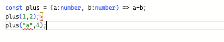
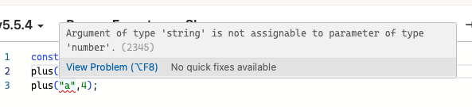
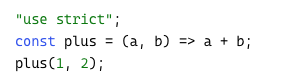
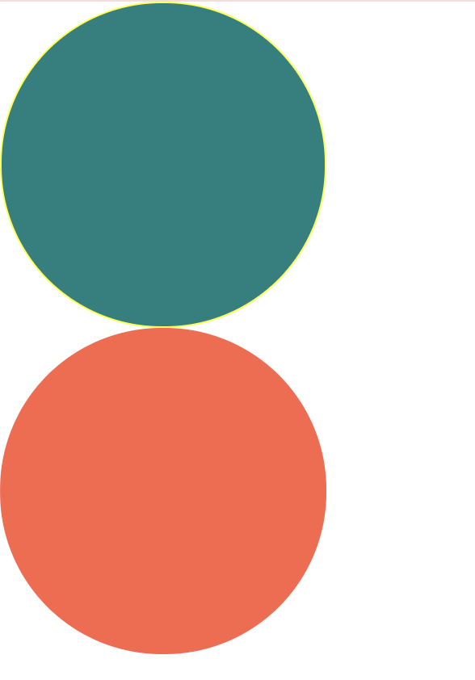
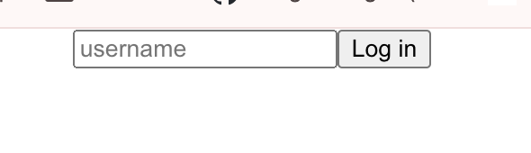

### TypeScript 학습

## 목차
1. `TypeScript`란
‼️Tip‼️ 설치 방법
2. 타입정의
3. React Props 타입 정의
4. Theme(다크모드, 라이트모드)
---

### 1. `TypeScript` : js를 기반으로 한 프로그래밍 언어
- **정적 타입 검사**를 추가한 언어로 코드 작성 시 타입 오류를 미리 잡아주며 코드의 `안정성`과 `가독성`을 높인다.
- 클래스, 인터페이스, 제네릭 등 객체지향 프로그래밍(OOP) 기능을 지원하며, 자바스크립트와 완전히 호환한다
- 대규모 프로젝트에서 유지보수성을 크게 향상시키며, IDE의 자동환성, 오류 검사 등의 지원도 강화해준다.

### ‼️Tip‼️ 설치 방법
```bash
$ npx create-react-app [폴더명] --template typescript
$ npm i --save-dev @types/styled-components
$ npm i styled-component
```

### 2. 타입정의
1. 함수의 타입을 정해준다
```javascript
const Add(a,b) => a+b;
Add(1,2); // 결과:  3
Add('1','2'); // 결과:  12
```
> `Add(1,2);` 의 코드는 숫자로 인식하여 숫자로 반환해 결과가 3이지만,
> `Add('1','2');`의 코드는 문자로 인식하여 숫자가 아닌 문자로 반환해 결과가 12인 것을 알 수 있다

> 이러한 문제를 해결하기 위해 해당 함수에 타입을 정의해주어 맞지 않는 타입의 변수나 함수에서 에러를 발생시켜 버그를 사전에 제거한다

2. 타입 정의
```javascript
const Add(a:number, b:number) => a+b;

Add(1,2); // 결과:  3
Add('1','2'); // 결과:  error
```


> Caption : 오류가 발생한 것을 볼 수있다.



### 3. React Props 타입 정의
> React 컴포넌트에서 TypeScript로 props 타입을 정의하는 방법

- 인터페이스 타입 정의
```javascript
import { useState } from "react";
import styled from "styled-components";
const Container = styled.div<ContainerProps>`
    width: 200px;
    height: 200px;
    background-color: ${(props) => props.bgColor};
    border: 1px solid ${(props) => props.borderColor};
    border-radius: 100px;
`;
interface ContainerProps{
    bgColor: string ;
    borderColor: string;
}
interface CircleProps{
    bgColor: string ;
    borderColor?: string; // ? : 있을수도 있고 없을 수도 있음(optoinal)
    text? : string;
}
function Circle({bgColor, borderColor, text = "default text"}:CircleProps){
    return <Container bgColor={bgColor} borderColor = {borderColor ?? bgColor}/>;
}
```


- 기본값 설정
` (event: React.FormEvent<HTMLFormElement>)` : React에서 폼 제출 이벤트에 대해 TypeScript로 타입을 명시하는 방법

> [기타 이벤트 확인 사이트](https://legacy.reactjs.org/docs/events.html)
```javascript
import { useState } from 'react';
import styled from 'styled-components';
import './App.css';

function App() {
  const [value, setvalue]= useState("");
  const onChange = (event : React.FormEvent<HTMLInputElement>) => {
    // console.log(event.currentTarget.value);
    const {
      currentTarget: {value},
    } = event;
    setvalue(value);
  };
  const onSubmit = (event: React.FormEvent<HTMLFormElement>) => {
    event.preventDefault();
    console.log("hello", value);
  };
  return (
    <div className="App">
      <form onSubmit={onSubmit}>
        <input value={value} onChange={onChange} type="text" placeholder='username' />
        <button>Log in</button>
      </form>
    </div>
  );
}

export default App;
```


🟠 `useState < number > ( )`

> - state의 type을 지정하려면 Generics안에 타입을 지정
> - 일반적으로는 초기값을 지정하면 타입스크립트가 자동으로 타입을 유추하기 때문에 굳이 지정해주지 않아도 되지만 상태가 undefined또는 null이 될 수도 있거나 객체 또는 배열일 때는 지정해주는 것이 좋다.

```javascript
const [ value, setValue ] = useState< Value | null >(null);
````


### 4. Theme(다크모드, 라이트모드)
> `styled.d.ts` 파일은 `TypeScript`와 함께 `styled-components`를 사용할 때, 커스텀 테마 또는 스타일링 관련 타입 정의를 위한 파일
```javascript
import 'styled-components';
// and extend them!
declare module 'styled-component'{
    export interface DefaultTheme{
        함수 타입 지정
    }
}
```

- 다크모드 화이트모드 테마 파일 생성

> Theme.ts
```javascript
import { DefaultTheme } from 'styled-components';

export const lightTheme:DefaultTheme ={
    bgColor: "white",
    textColor: "black",
    btnColor: "tomato"
};

export const darkTheme:DefaultTheme ={
    bgColor: "black",
    textColor: "white",
    btnColor: "teal"
};
```

> index.tsx
```javascript
import React from 'react';
import ReactDOM from 'react-dom/client';
import { ThemeProvider } from 'styled-components';
import App from './App';
import './index.css';
import reportWebVitals from './reportWebVitals';
import { darkTheme } from './Them';

const root = ReactDOM.createRoot(
  document.getElementById('root') as HTMLElement
);
root.render(
  <React.StrictMode>
    <ThemeProvider theme={darkTheme}>
    <App />
    </ThemeProvider>
  </React.StrictMode>
);

// If you want to start measuring performance in your app, pass a function
// to log results (for example: reportWebVitals(console.log))
// or send to an analytics endpoint. Learn more: https://bit.ly/CRA-vitals
reportWebVitals();
```

> App.ts
```javascript
import styled from 'styled-components';
import './App.css';

const Container = styled.div`
  background-color: ${(props)=> props.theme.bgColor};
`;

const H1 = styled.h1`
  color: ${(props)=> props.theme.textColor};
`;

function App() {
  return (
    <div className="App">
      <Container>
        <H1>Hello</H1>
      </Container>
    </div>
  );
}

export default App;
```
